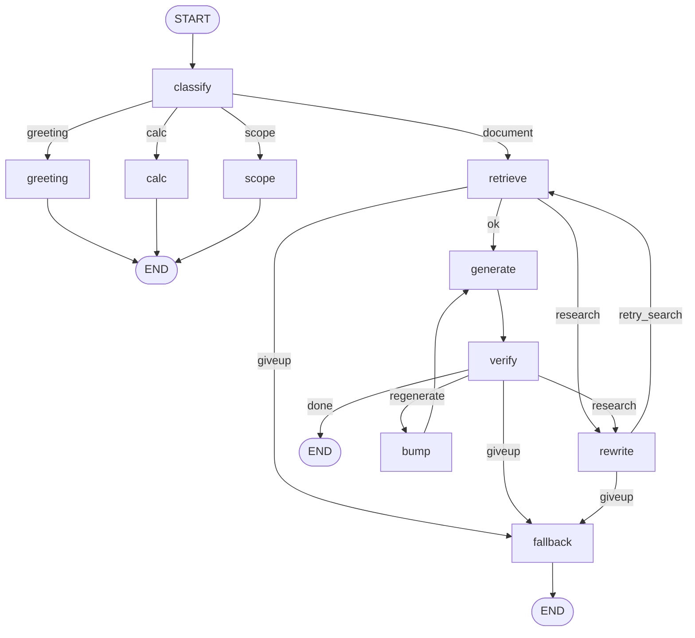

[README.md](https://github.com/user-attachments/files/32940405/README.md)
# LangGraph로 만드는 문서 기반 RAG 챗봇

사내 문서(PDF)를 읽어 **근거를 인용하며 답하는 RAG 시스템**을 단계별로 만드는 강의 실습 저장소입니다.
LangChain으로 기본 RAG 파이프라인(로드 → 분할 → 임베딩 → 검색 → 생성)을 완성한 뒤,
**LangGraph**로 옮겨 *질문 분류 · 답변 검증 · 재생성 · 질문 재작성 · 장애 대응 · 운영 로그*까지 갖춘 Modular RAG로 확장합니다.

| 구분 | 내용 |
|---|---|
| 언어 | Python 3 |
| 프레임워크 | LangChain 1.x, LangGraph 1.x |
| LLM / 임베딩 | OpenAI `gpt-4o-mini` / `text-embedding-3-small` |
| 벡터 DB | FAISS (로컬 저장) |
| UI | 콘솔, Streamlit |

---

## 📁 폴더 구조

```
langgraph_hkd/
├── data/                  # 실습용 문서
│   ├── notice.txt / notice.pdf   # 공지사항 (5~6강 로더 실습)
│   ├── manual.pdf                # 고객 응대 매뉴얼 (RAG 메인 문서)
│   └── 임베딩이해.pdf             # 개인 실습용 문서
├── src/
│   ├── 05 ~ 13/           # 1부: LangChain 기본 RAG 구성 요소
│   ├── 15_rag_app/        # 1부 완성본: 콘솔 + Streamlit RAG 앱
│   ├── 17 ~ 22/           # 2부: LangGraph 기초 & RAG 마이그레이션
│   ├── 24 ~ 32/           # 3부: Modular RAG 고도화
│   ├── practice/          # 15강 앱을 다른 문서(임베딩이해.pdf)에 적용한 실습
│   └── test.py
├── practice/              # src/practice 와 동일 구조의 실습본
├── requirements.txt
└── .gitignore             # venv/, .env, __pycache__ 제외
```

> 강의 번호가 비어 있는 차시(1~4, 14, 16, 23, 28강)는 이론·환경 설정·복습 차시로 별도 코드가 없습니다.

---

## ⚙️ 실행 환경 준비

```bash
# 1) 가상환경
python -m venv venv
venv\Scripts\activate          # macOS/Linux: source venv/bin/activate

# 2) 패키지 설치
pip install -r requirements.txt
pip install langchain-community langchain-openai langchain-text-splitters pymupdf streamlit
```

```bash
# 3) 프로젝트 루트에 .env 파일 생성
OPENAI_API_KEY=sk-...
```

**실행 시 주의**
- 대부분의 예제가 `../../data/...` 같은 **상대 경로**를 쓰므로, 해당 차시 폴더로 이동한 뒤 실행하세요.
  ```bash
  cd src/08
  python 01_first_rag.py
  ```
- 차시 간 모듈은 `sys.path.insert()`로 이전 차시 폴더를 참조합니다. 예를 들어 11강은 10강의 `indexer.py`를 씁니다.
  그래서 **숫자 접두어가 없는 파일**(`ingest.py`, `prepare.py`, `indexer.py`, `retriever.py` 등)은 다음 차시에서 import하려고 만든 복사본입니다.
- 24강 이후 코드는 `src/config.py`와 `src/rag_app/`을 import합니다. 저장소에 없다면 `src/15_rag_app/`을 `src/rag_app/`으로 복사하고, 그 안의 `config.py`를 `src/config.py`로 복사하세요. 24강 이후에 쓰는 `MAX_RETRY`, `MAX_REWRITE` 값은 없으면 기본값 2가 적용됩니다.
- 임베딩 모델이나 청크 설정을 바꾸면 `faiss_index/`를 지우거나 `get_store(rebuild=True)`로 인덱스를 다시 만드세요.

---

## 📚 강의별 정리

### 1부. LangChain으로 기본 RAG 만들기 (5~15강)

#### 5강 · 문서 로드, 분할, 프롬프트 맛보기 — `src/05`
| 파일 | 내용 |
|---|---|
| `01_testloader.py` | `TextLoader`로 `notice.txt`를 읽어 `Document`의 구조(`page_content`, `metadata`) 확인 |
| `02_load_and_split.py` | `RecursiveCharacterTextSplitter(chunk_size=150, overlap=30)`로 청크 분할 |
| `03_prompt_template.py` | `PromptTemplate`에 `{doc}`, `{q}` 변수를 채워 프롬프트 만들기 |

#### 6강 · PDF 로드와 전처리 (Ingest) — `src/06`
| 파일 | 내용 |
|---|---|
| `01_load_test.py` | 텍스트 로더 복습 |
| `02_load_pdf.py` | `PyMuPDFLoader`로 PDF 로드 후 분할 |
| `03_validate.py` | 페이지 텍스트가 10자 미만이면 **스캔 PDF 의심** 경고 |
| `04_ingest.py` / `ingest.py` | `load_documents()`: 노이즈 문자열(예: "대외비") 제거, 연속 줄바꿈 정리, 메타데이터(파일명, 페이지 번호) 정리 |

#### 7강 · 청크 분할 전략 — `src/07`
| 파일 | 내용 |
|---|---|
| `01_split_basic.py` | `separators=["\n\n", "\n", ".", " "]` 지정 분할 |
| `02_check_overlap.py` | 전체 문서를 합친 뒤 분할해 청크 간 **overlap**이 실제로 겹치는지 확인 |
| `03_prepare.py` / `prepare.py` | `prepare_chunk(path)`: 로드, 분할(200/50), 청크마다 `chunk_id` 부여 |

#### 8강 · 첫 번째 RAG — `src/08`
| 파일 | 내용 |
|---|---|
| `01_first_rag.py` | 청크 → `OpenAIEmbeddings` → `FAISS.from_documents` → 검색 → `ChatOpenAI` 답변까지 한 번에 구성 |
| `02_test_rag.py` | 여러 질문으로 첫 RAG 결과 테스트 |

#### 9강 · 임베딩과 유사도 — `src/09`
| 파일 | 내용 |
|---|---|
| `01_embed_look.py` | 문장 임베딩의 차원 수(1536)와 실제 벡터 값 확인 |
| `02_similarity.py` | 직접 구현한 **코사인 유사도**로 문장 쌍 비교 (환불↔반품, 환불↔점심 메뉴) |
| `03_find_threshold.py` | 관련/무관 문장 점수를 비교해 검색 **임계값(MIN_SCORE)**을 실측으로 찾기 |

#### 10강 · 벡터 인덱스 저장과 재사용 — `src/10`
| 파일 | 내용 |
|---|---|
| `01_build_index.py` | FAISS 인덱스 생성 후 `save_local("faiss_index")` |
| `02_load_index.py` | `load_local(...)`로 다시 불러와 검색 |
| `03_indexer.py` | `get_store(rebuild=False)`: 인덱스가 있으면 로드하고, 없으면 생성 |
| `04_indexer2.py` / `indexer.py` | 인덱스 생성 정보(원본, 모델, 청크 설정, 생성 시각)를 `build_info.json`으로 기록 |

#### 11강 · Retriever 튜닝 — `src/11`
| 파일 | 내용 |
|---|---|
| `01_retriever_test.py` | `similarity_search_with_relevance_scores`로 **k값(1/3/5)**에 따른 결과와 점수 비교 |
| `02_retriever.py` / `retriever.py` | `similarity` 와 **MMR**(다양성 검색) 비교, `search()`와 `build_context()`(번호 붙인 근거 문자열) 제공 |

#### 12강 · RAG 실패 진단 — `src/12`
| 파일 | 내용 |
|---|---|
| `01_diagnose.py` | 질문 유형 4가지로 검색 점수와 답변을 점검: ① 문서에 명확히 있음 ② 같은 뜻 다른 표현 ③ 문서에 없음 ④ 여러 조항에 걸친 복합 질문 |

#### 13강 · 프롬프트 설계와 답변 검증 — `src/13`
| 파일 | 내용 |
|---|---|
| `01_prompts.py` / `prompts.py` | 프롬프트 버전 관리. **V1** 최소형, **V2** 규칙 강화(자료에만 근거, `[1]` 인용 필수), **V3** 부분 답변 허용(과잉 거부 방지). 이후 강의에서 쓸 `RETRY_PROMPT`, `JUDGE_PROMPT`, `CLASSIFY_PROMPT`, `REWRITE_PROMPT`도 이 파일에 정의 |
| `02_compare_prompt.py` | 같은 질문을 V1/V2/V3로 답해 비교 |
| `03_validators.py` / `validators.py` | `check_citation()`: 답변의 `[n]` 인용 번호가 실제 근거 개수 범위 안에 있는지 검사 |
| `04_rag_v3.py` | V3 프롬프트, LCEL 체인(`prompt | llm | parser`), 인용 검증을 묶은 `ask()` |

#### 15강 · RAG 앱 완성 — `src/15_rag_app`
지금까지 만든 구성 요소를 하나의 앱으로 정리했습니다.

| 파일 | 내용 |
|---|---|
| `config.py` | 실험 결과를 반영한 설정을 한곳에 모음: `CHUNK_SIZE=500`, `TOP_K=5`, `MIN_SCORE`, `PROMPT_VER="v3"`, `gpt-4o-mini`, `temperature=0` |
| `indexer.py` | 로드, 정리, 분할, 인덱싱 (`get_store`) |
| `rag.py` | `ask(question)` → `{answer, sources, ...}`: 검색, 컨텍스트 구성, 생성, 인용 검증, 예외 처리 |
| `app.py` | 콘솔 챗봇 (`q`/`exit`/`종료`로 끝냄) |
| `web.py` | **Streamlit** 웹 UI (`streamlit run web.py`) |

---

### 2부. LangGraph 기초와 RAG 이식 (17~22강)

#### 17강 · LangGraph 첫걸음 — `src/17`
| 파일 | 내용 |
|---|---|
| `01_설치확인.py` | LangGraph 설치 확인 |
| `02_saimple_graph.py` | `StateGraph` + `TypedDict` State, 노드 2개(`search → answer`), `START`/`END` 연결 |
| `03_conditional_graph.py` | `add_conditional_edges`로 **조건 분기** (검색 품질에 따라 다른 경로) |
| `04_visual_graph.py` | `get_graph().draw_mermaid_png()`로 그래프 구조를 이미지로 저장 |

#### 18강 · State와 Reducer — `src/18`
| 파일 | 내용 |
|---|---|
| `01_state_demo.py` | 노드가 State의 일부만 반환하면 병합되는 원리 |
| `02_reducer_demo.py` | Reducer(`Annotated[list, operator.add]`)가 **없으면 덮어쓰고, 있으면 누적**되는 차이 비교 |
| `03_graph_state.py` / `graph_state.py` | RAG용 `RAGState` 정의: `question`/`query`, `documents`/`scores`/`retrieval_ok`, `answer`/`insufficient`/`has_citation`, 검증 결과, 재시도 횟수, `log`/`tried_queries`(누적) |
| `04_graph_state2.py` | 초기값을 만드는 `make_initial_state()` 추가 |

#### 19강 · RAG를 노드로 분리 — `src/19`
| 파일 | 내용 |
|---|---|
| `01_retrieve.py` / `retrieve.py` | **Retriever Node**: 기준 점수 이상인 문서만 State에 저장 |
| `02_generate.py` / `generate.py` | **Generator Node**: 근거로 답변 생성, 자료 부족 여부와 인용 정상 여부 반환 |
| `03_fallback.py` / `fallback.py` | **Fallback Node**: 검색 실패 시 안내 메시지와 시도한 검색어 표시 |
| `04_manual_flow.py` | LangGraph 없이 노드를 **직접 if문으로 연결**해 흐름 이해하기 |

#### 20강 · 노드를 그래프로 연결 — `src/20`
| 파일 | 내용 |
|---|---|
| `01_routes.py` / `routes.py` | 라우터 함수 `route_after_retrieve()` → `"ok"` 또는 `"empty"` |
| `02_graph_v1.py` | `retrieve → (generate | fallback) → END` 그래프 |
| `03_graph_v2.py` | 그래프 구조를 출력하고 `graph.png`로 저장 |
| `04_graph_v3.py` | 정상 질문과 검색 실패 질문으로 두 경로 테스트 |
| `05_loop.py` / `loop.py` | 자기 자신으로 가는 무한 루프와 **`recursion_limit`**으로 멈추는 동작 확인 |

#### 21강 · 더미 데이터로 Modular RAG 설계 — `src/21`
LLM이나 검색 없이 **가짜 노드**로 전체 흐름(검색 → 생성 → 검증 → 재시도 → fallback)을 먼저 설계하고 검증합니다.

| 파일 | 내용 |
|---|---|
| `mini_graph.py` | `MiniState`와 `init()` 정의 |
| `mini_graph2.py`, `mini_graph_nodetest.py` | 더미 노드(`retrieve`, `generate`, `verify`, `bump`, `fallback`) 단위 테스트 |
| `mini_graph_node_conn.py` | 노드 연결: `generate → verify → (pass면 END, 아니면 bump → generate, 한도 초과면 fallback)` |
| `mini_graph_node_image.py` | 그래프 구조 이미지 생성 (`graph_structure.png`) |

#### 22강 · 15강 앱을 LangGraph로 마이그레이션 — `src/22`
| 파일 | 내용 |
|---|---|
| `graph_step_by_step.py` | 1단계(검색만), 2단계(+생성), 3단계(+fallback 분기) 순서로 그래프를 키워 가기 |
| `graph.py` / `graph22.py` | `build_graph()`와 `ask(question)`. 15강과 같은 인터페이스로 답변과 출처 반환 |
| `app.py` | LangGraph 버전 콘솔 앱 |
| `test_migration.py` | **회귀 테스트**: 같은 질문으로 15강 함수형과 22강 그래프형의 답변이 같은지 비교 |
| `test_migration_stream.py` | `stream()`으로 실제 실행된 노드 경로 출력 |

---

### 3부. Modular RAG 고도화 (24~32강)

#### 24강 · Retriever Node 고도화 — `src/24`
| 파일 | 내용 |
|---|---|
| `retriever.py` | similarity/MMR 검색 지원, **검색 점수와 실패 원인**을 함께 반환 |
| `retriever_retries.py` | 재시도할수록 `top_k`를 3씩 늘리고 `min_score`를 0.05씩 낮춤 |
| `graph.py`, `graph25.py`, `graph27.py` | 24, 25, 27강 단계별 그래프 (27강 그래프의 미리보기 포함) |

#### 25강 · Generator Node 고도화 — `src/25`
| 파일 | 내용 |
|---|---|
| `generator.py` | 근거가 없으면 **LLM을 호출하지 않고** 바로 안내 (비용 절감), 인용 검증 포함 |
| `generator2.py` | 재시도 시 **이전 실패 이유를 `RETRY_PROMPT`에 넣어** 재생성 |

#### 26강 · Verifier Node (LLM-as-a-Judge) — `src/26`
| 파일 | 내용 |
|---|---|
| `verifier.py` | `JUDGE_PROMPT`로 LLM이 답변과 근거를 대조해 JSON으로 판정. 결과는 `pass` / `retry`(재생성) / `research`(재검색) / `giveup` |

#### 27강 · 검증, 재시도 루프 완성 — `src/27`
| 파일 | 내용 |
|---|---|
| `graph27.py` | `retrieve → generate → verify`. 실패하면 `bump`(재시도 횟수 +1) 후 다시 생성하고, `MAX_RETRY`(2회)를 넘으면 `fallback` |
| `test_retry.py` | 노드 실행 순서와 `log` 추적 |
| `compare_v22_v27.py` | 22강과 27강 그래프 품질 비교: 정답 키워드 포함률, **문서에 없는 질문의 환각 여부** |

#### 29강 · 질문 의도 분류 (Router) — `src/29`
| 파일 | 내용 |
|---|---|
| `classifier.py` | **규칙 우선, 애매하면 LLM**으로 분류 (`CLASSIFY_PROMPT`). 의도: `greeting` / `calc` / `scope`(범위 밖) / `document` |
| `intents.py` | `greeting_node`, `calc_node`(숫자·연산자만 허용하는 정규식 검사 후 계산), `scope_node` |
| `graph29.py` | `classify`로 시작해 의도별 노드로 분기하고, 문서 질문만 RAG 파이프라인으로 보냄 |
| `test_routing.py` | 예상 분류와 실제 분류 비교 테스트 |

#### 30강 · Query Rewrite와 재검색 — `src/30`
| 파일 | 내용 |
|---|---|
| `rewriter.py` | 검색에 실패하면 `REWRITE_PROMPT`로 **검색용 query만 다시 작성** (원본 question은 유지), 최대 `MAX_REWRITE`(2회) |
| `graph30.py` | 검색 실패나 Verifier의 `research` 판정 시 `rewrite → retrieve`로 다시 검색 |
| `test_rewrite.py` | 표현이 달라 검색에 실패하기 쉬운 질문으로 재작성 효과 확인 |

#### 31강 · 방어적 코딩과 운영 로그 — `src/31`
| 파일 | 내용 |
|---|---|
| `safe.py` | `safe_node(fn, state)`: 노드에서 예외가 나도 그래프가 멈추지 않고 `node_error`를 기록 |
| `graph31.py` | 모든 핵심 노드를 `safe_*_node`로 감싼 그래프 |
| `logger.py` | 질문, 의도, 판정, 재시도·재작성 횟수, 오류, 응답 시간을 `logs/queries.jsonl`에 기록 |
| `analyze_logs.py` | 로그 통계: 총 질문 수, 통과율, 의도 분포, 재작성·오류 건수, 평균 응답 시간 |
| `test_failure.py` | 일부러 오류를 내는 노드로 장애 상황 테스트 |

#### 32강 · 최종 통합과 테스트 — `src/32`
| 파일 | 내용 |
|---|---|
| `graph32.py` | 지금까지의 노드를 모두 연결한 **최종 그래프** |
| `test_coverage.py` | 모든 노드가 최소 한 번씩 실행되는지 확인하는 **경로 커버리지 테스트** |
| `test_regression.py` | 정답 핵심 키워드 포함 여부로 **회귀 테스트** |

---

## 🧭 최종 그래프 구조 (32강)



| 노드 | 역할 | 도입 강의 |
|---|---|---|
| `classify` | 질문 의도 분류 (규칙 + LLM) | 29강 |
| `greeting` / `calc` / `scope` | 인사, 계산, 범위 밖 질문에 바로 답함 | 29강 |
| `retrieve` | FAISS 검색 + 점수 필터 | 19 → 24강 |
| `rewrite` | 검색용 질문 재작성 | 30강 |
| `generate` | 근거 기반 답변 + 인용 | 19 → 25강 |
| `verify` | LLM 심판의 답변 검증 | 26강 |
| `bump` | 재시도 횟수 증가 | 21 → 27강 |
| `fallback` | 실패 안내 | 19강 |

**운영 로그 예시** (`src/31/logs/queries.jsonl`)
```json
{"question": "환불은 며칠 이내에 신청해야 하나요?", "intent": "document", "grade": "pass", "retries": 0, "rewrites": 0, "elapsed": 6.69}
{"question": "대표이사가 누구인가요?", "intent": "document", "grade": "giveup", "retries": 0, "rewrites": 2, "elapsed": 3.41}
```
문서에 없는 질문("대표이사")은 재작성을 2번 시도한 뒤 지어내지 않고 `giveup`으로 끝납니다. 환각을 막는 설계가 의도대로 동작한다는 뜻입니다.

---

## 🔑 핵심 튜닝 값 요약

| 항목 | 값 | 근거 |
|---|---|---|
| `CHUNK_SIZE` / `OVERLAP` | 500 / 50 | overlap은 chunk_size의 10% |
| `TOP_K` | 5 | 3에서 5로 늘렸을 때 정답률 +10%p, 8은 노이즈로 하락 |
| `MIN_SCORE` | 9강 실측값 | 관련·무관 문장 점수 분포로 결정 |
| `PROMPT_VER` | v3 | v2보다 정답률 +10%p, 토큰 증가 없음 |
| `TEMPERATURE` | 0 | 재현 가능한 답변 |
| `MAX_RETRY` / `MAX_REWRITE` | 2 / 2 | 무한 루프 방지와 비용 제어 |

---

## 🧪 실습 (`src/practice`, `practice`)
15강 RAG 앱을 다른 문서(`data/임베딩이해.pdf`)에 적용한 개인 실습입니다. `config.py`의 `DOC_PATH`와 `CHUNK_SIZE=200`, `CHUNK_OVERLAP=20`만 바꿔서 같은 코드를 재사용할 수 있음을 확인합니다.
